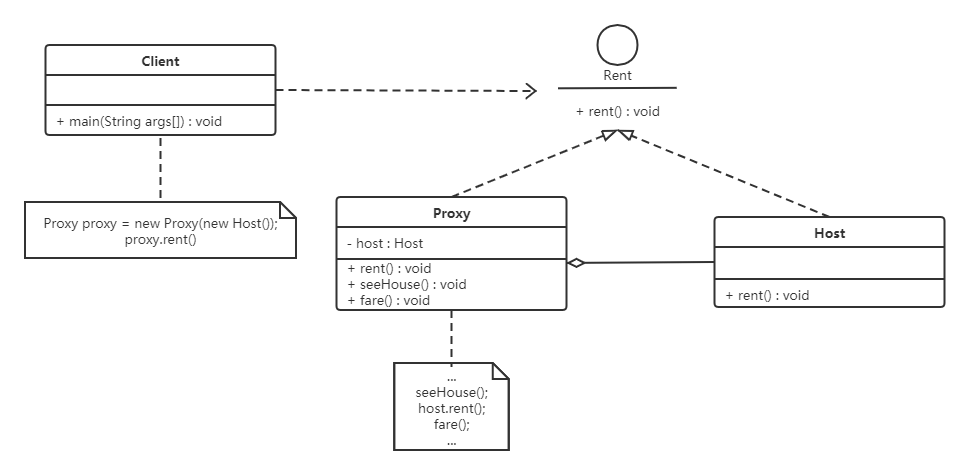

## 代理模式的定义与特点

代理模式的定义：由于某些原因需要给某对象提供一个代理以控制对该对象的访问。这时，访问对象不适合或者不能直接引用目标对象，代理对象作为访问对象和目标对象之间的中介。

代理模式的主要优点有：

- 代理模式在客户端与目标对象之间起到一个中介作用和保护目标对象的作用；
- 代理对象可以扩展目标对象的功能；
- 代理模式能将客户端与目标对象分离，在一定程度上降低了系统的耦合度；


其主要缺点是：

- 在客户端和目标对象之间增加一个代理对象，会造成请求处理速度变慢；
- 增加了系统的复杂度；


## 代理模式的结构与实

代理模式的结构比较简单，主要是通过定义一个继承抽象主题的代理来包含真实主题，从而实现对真实主题的访问，下面来分析其基本结构和实现方法。

代理模式的主要角色如下。

1. 抽象主题（Subject）类：通过接口或抽象类声明真实主题和代理对象实现的业务方法。
2. 真实主题（Real Subject）类：实现了抽象主题中的具体业务，是代理对象所代表的真实对象，是最终要引用的对象。
3. 代理（Proxy）类：提供了与真实主题相同的接口，其内部含有对真实主题的引用，它可以访问、控制或扩展真实主题的功能。


其结构图如图 1 所示。

<center>
<br>图1 代理模式的结构图</center>


## 静态代理

应用实例：租房



```java
//抽象角色：租房
public interface Rent {
    public void rent();
}
//真实角色: 房东，房东要出租房子
public class Host implements Rent{
    public void rent() {
        System.out.println("房屋出租");
    }
}
//代理角色：中介
public class Proxy implements Rent {
 
    private Host host;
    public Proxy() { }
    public Proxy(Host host) {
        this.host = host;
    }
    
    //租房
    public void rent(){
        seeHouse();
        host.rent();
        fare();
    }
    
    public void seeHouse(){
        System.out.println("带房客看房");
    }
    
    public void fare(){
        System.out.println("收中介费");
    }
}
//客户
public class Client {
    public static void main(String[] args) {
        //房东要租房
        Host host = new Host();
        //中介帮助房东
        Proxy proxy = new Proxy(host);
        //你去找中介！
        proxy.rent();
    }
}
```

分析：在这个过程中，你直接接触的就是中介，就如同现实生活中的样子，你看不到房东，但是你依旧租到了房东的房子通过代理，这就是所谓的代理模式，程序源自于生活，所以学编程的人，一般能够更加抽象的看待生活中发生的事情。

静态代理的好处:

- 可以使得我们的真实角色更加纯粹 . 不再去关注一些公共的事情
- 公共的业务由代理来完成 . 实现了业务的分工
- 公共业务发生扩展时变得更加集中和方便

缺点 :类多了 , 多了代理类 , 工作量变大了 . 开发效率降低


## 动态代理