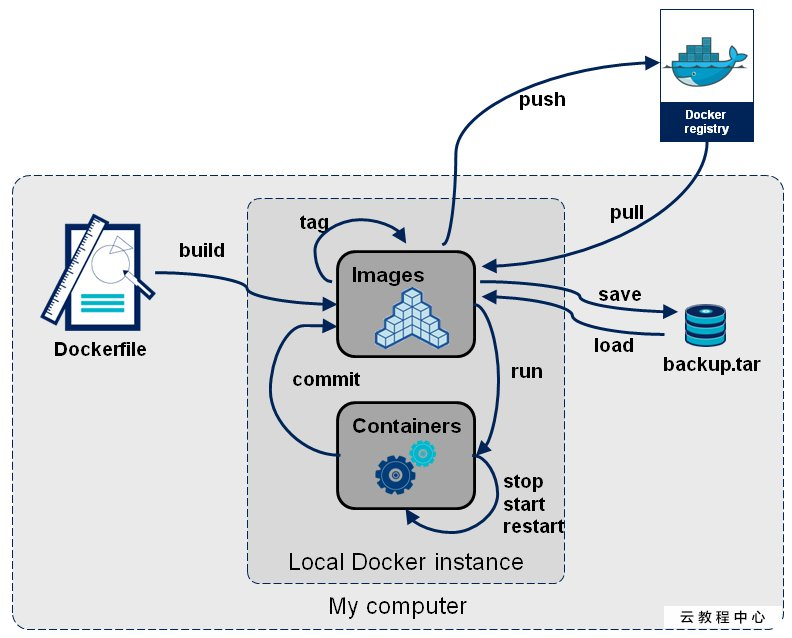

**笔记整理来源 B站UP主[遇见狂神说](https://space.bilibili.com/95256449/)**

## Docker容器数据卷

 在Docker容器的实际使用中，经常会遇到容器的数据持久化，容器之间的数据共享等问题，通常我们有两种解决方案：

1. 数据卷（Data Volumes）：就是将容器内数据直接映射到本地主机环境的指定文件目录之中，可以理解为容器挂载一个虚拟数据卷然后    映射到一个主机目录中 
2. 数据卷容器（Data Volume Containers）：用专门的容器来挂载数据卷，其他容器通过挂载这个父容器来实现数据共享，这个专门挂载数据卷的容器就是数据卷容器，简单的总结就是有一个容器来专门管理数据的持久化和容器之间数据共享。

<!-- more -->

### 使用数据卷

> 方式一：直接使用命令挂载 -v

- 指定路径进行挂载

  ```bash
  #指定路径挂载 -v 宿主机路径:容器内路径 
  docker run --name vhr-data -e MYSQL_ROOT_PASSWORD=123456 -v /home/atomsk/mysql/db:/var/lib/mysql -d -p 3306:3306 mysql
  ```

- 匿名挂载和具名挂载

  ```bash
  # 匿名挂载 -v 容器内路径
  $ docker run -d -P --name nginx01 -v /etc/nginx nginx
  $ docker volume ls    # 查看所有的volume的情况
  DRIVER              VOLUME NAME
  local               33ae588fae6d34f511a769948f0d3d123c9d45c442ac7728cb85599c2657e50d   
  
  # 具名挂载 -v 卷名:容器内路径
  $ docker run -d -P --name nginx02 -v juming-nginx:/etc/nginx nginx
  $ docker volume ls               
  DRIVER              VOLUME NAME
  local               juming-nginx
  ```

  也可以通过`docker volume inspect 卷名`查看卷的情况

  

  **注意**：所有的Docker容器内的卷，在没有指定目录的情况下都是在`/var/lib/docker/volumes/xxxx/_data`路径下的

  **拓展：**容器对宿主机文件的操作权限

  ```bash
  # 通过 -v 容器内路径： ro rw 改变读写权限
  ro #readonly 只读
  rw #readwrite 可读可写
  $ docker run -d -P --name nginx05 -v juming:/etc/nginx:ro nginx
  $ docker run -d -P --name nginx05 -v juming:/etc/nginx:rw nginx
  
  # ro 只要看到ro就说明这个路径只能通过宿主机来操作，容器内部是无法操作！
  ```

> 方式二：通过Dockerfile添加

**注意**：出于可移植可分享的的考虑，用以上 -v /宿主机绝对路径目录 : /容器内目录 的这种方式不能够直接在DockerFile中直接实现，因为宿主机目录是依赖于特定的宿主机的，并不能保证所有的宿主机都存在这样特定的目录

假设编写的DockerFile如下

```dockerfile
FROM  镜像名

VOLUME ["/容器内路径"]

CMD echo "success build"

CMD /bin/bash
```

指令`VOLUME ["/生成的目录路径"]`就相当于` docker run -it -v /容器内路径`，即**匿名挂载**

### 使用数据卷容器

```bash
$ docker run -it - -name parentContainer 镜像名

$ docker run -it - -name sonContainer1 --volumes -from parentContainer 镜像名
$ docker run -it - -name sonContainer2 --volumes -from parentContainer 镜像名
```

官网上有一句话描述的是，容器之间配置信息的传递，数据卷的生命周期会一致持续到没有容器使用它为止，换言之，只要有一个容器仍在使用该数据卷，该数据卷一直都可以进行数据共享。

通俗地来说，如果此时我们把父容器关闭掉，两个字容器之间依旧可以进行数据共享，而且通过继承子容器生成的新容器，一样可以与子容器进行数据共享。这就是docker容器间的数据传递共享。

## Dockerfile

Dockerfile 就是用来构建docker镜像的构建文件，是一个命令参数脚本。

### 构建步骤

1. 编写一个Dockerfile文件
2. docker build -f Dockerfile名 -t 命名空间/镜像名:[tag] 构建出一个镜像
3. docker run 运行镜像（测试）
4. docker push 发布镜像（DockerHub 、阿里云仓库)

### Dockerfile的编写

基础知识：

1. 每个保留关键字都是必须是大写字母
2. 从上到下顺序执行，#表示注释
3. 每一个指令都会创建一个新的镜像层

Dockerfile指令：

```dockerfile
FROM				# 基础镜像，一切从这里开始构建
MAINTAINER			# 镜像是谁写的， 姓名+邮箱
RUN					# 镜像构建的时候需要运行的命令
ADD					# 格式举例：ADD tomcat.tar.gz /usr/local/，会自动解压
WORKDIR				# 镜像的工作目录
VOLUME				# 挂载的目录
EXPOSE				# 保留端口配置
CMD					# 指定这个容器启动的时候默认运行的命令，当指定其他命令时会被替换。ls -a 指定-l =》 -l 报错
ENTRYPOINT			# 指定这个容器启动的时候默认运行的命令，可以在其基础上追加命令 ls -a，追加-l =》 ls -al
ONBUILD				# 当构建一个被继承 DockerFile 这个时候就会运行ONBUILD的指令，触发指令。
COPY				# 类似ADD，直接将文件拷贝到镜像中
ENV					# 构建的时候设置环境变量！
```

✅可以通过`docker history 镜像id`查看镜像的构建过程

### 实战：Tomcat镜像构建

1. 准备镜像文件

    准备tomcat 和 jdk到当前目录，编写好README

2. 编写Dokerfile

```dockerfile
FROM centos #
MAINTAINER Atomsk<Atomsk@126.com>
COPY README /usr/local/README #复制文件
ADD jdk-8u231-linux-x64.tar.gz /usr/local/ #复制解压
ADD apache-tomcat-9.0.35.tar.gz /usr/local/ #复制解压
RUN yum -y install vim
ENV MYPATH /usr/local #设置环境变量
WORKDIR $MYPATH #设置工作目录
ENV JAVA_HOME /usr/local/jdk1.8.0_231 #设置环境变量
ENV CATALINA_HOME /usr/local/apache-tomcat-9.0.35 #设置环境变量
ENV PATH $PATH:$JAVA_HOME/bin:$CATALINA_HOME/lib #设置环境变量 分隔符是：
EXPOSE 8080 #设置暴露的端口
CMD /usr/local/apache-tomcat-9.0.35/bin/startup.sh && tail -F /usr/local/apache-tomcat-9.0.35/logs/catalina.out # 设置默认命令
```

3. 构建镜像

```bash
# 因为dockerfile命名使用默认命名 因此不用使用-f 指定文件
$ docker build -t mytomcat:0.1 .
```

4. run镜像

```bash
$ docker run -d -p 8080:8080 --name tomcat01 -v /home/atomsk/build/tomcat/test:/usr/local/apache-tomcat-9.0.35/webapps/test -v /home/atomsk/build/tomcat/tomcatlogs/:/usr/local/apache-tomcat-9.0.35/logs mytomcat:0.1
```

5. 访问测试

6. 发布项目(由于做了卷挂载，我们直接在本地编写项目就可以发布了！)

### 发布镜像

发布到Dockerhub：

1. 注册，地址 https://hub.docker.com/

2. 登录

```bash
$ docker login -u 用户名
#回车然后输入密码
```

3. 提交 push镜像

```bash
# push不上去的解决方法
# 第一种 build的时候添加你的dockerhub用户名，然后在push就可以放到自己的仓库了
$ docker build -t atomsk/mytomcat:0.1 .
# 第二种 使用docker tag #然后再次push
$ docker tag 容器id atomsk/mytomcat:1.0 #然后再次push
```

发布到阿里云镜像服务器：

​	详见官网：https://cr.console.aliyun.com/repository/

---

### 小结

