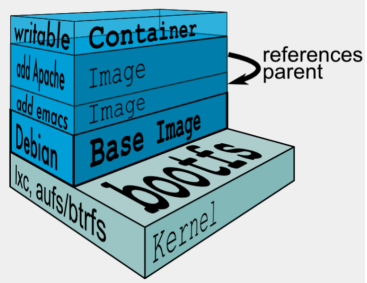

**笔记整理来源 B站UP主[遇见狂神说](https://space.bilibili.com/95256449/)**

## Docker基本概念

Docker是一个使用容器**开发**、**部署**和**运行**应用程序的平台。使用Linux容器部署应用程序称为容器化。

容器化越来越受欢迎，是因为容器有以下特点：

- 灵活性：即使是最复杂的应用程序也可以被容器化
- 轻量级：容器利用并共享主机内核
- 可互换的：你可以实时部署更新和升级
- 可移植性：你可以在本地构建、部署到云，并在任何地方运行
- 可伸缩：你可以增加并自动分发容器副本
- 可叠加：你可以垂直地、动态地叠加服务

<!-- more -->

## Docker的基本组成


**镜像（image)：**一个镜像是一个可执行包，它包含运行应用程序所需的所有内容，包括代码、运行时环境、库、环境变量、配置文件。

**容器(container)：**容器是镜像的运行时实例。可以把一个容器理解成一个简易的 Linux系统。

**仓库(repository)：**仓库就是存放镜像的地方，Docker Hub是国外的，所以要下载镜像前要配置阿里云镜像加速器。

### 容器和虚拟机对比


## Docker安装

帮助文档：https://docs.docker.com/engine/install/
```bash
#1.卸载旧版本
$ yum remove docker \
                  docker-client \
                  docker-client-latest \
                  docker-common \
                  docker-latest \
                  docker-latest-logrotate \
                  docker-logrotate \
                  docker-engine
#2.Install the yum-utils package (which provides the yum-config-manager utility) and set up the stable repository.
$ yum install -y yum-utils
$ yum-config-manager \
    --add-repo \
   https://mirrors.aliyun.com/docker-ce/linux/centos/docker-ce.repo #此处用阿里云的仓库
#更新yum软件包索引
$ yum makecache fast
#3.安装docker相关的 docker-ce 社区版 而ee是企业版
$ yum install docker-ce docker-ce-cli containerd.io
#4. 使用docker version查看是否按照成功
$ docker version
#5. 测试
$ docker run hello-world
```

**安装完成后配置阿里云镜像加速器**

## Docker常用命令

帮助文档：https://docs.docker.com/reference/

### 镜像命令

使用docker image查看所有镜像相关命令

```bash
docker images #查看所有本地主机上的镜像
docker pull IMAGE[:TAG] #下载镜像
docker rmi IMAGE #删除镜像
```

### 容器命令

使用docker containter查看所有容器相关明命令

```bash
docker ps #列出所有运行中的容器
docker run 镜像id #新建容器并启动
docker rm 容器id #删除指定容器
```
常用的镜像创建示例
```bash
mysql：
docker run --name vhr-data -e MYSQL_ROOT_PASSWORD=123456 -v /home/atomsk/mysql/db:/var/lib/mysql -d -p 3306:3306 mysql

redis：
docker run --name vhr-redis -d -p 6379:6379 redis

rabbitmq：
docker run --name vhr-rabbitmq -d -p 5672:5672 -p 15672:15672 rabbitmq

nginx：
docker run --name vhr-nginx -v /home/atomsk/vhr/vuehr:/usr/share/nginx/html -v /home/atomsk/vhr/nginx/nginx.conf:/etc/nginx/nginx.conf -d -p 8085:80 nginx
或者
docker run --name vhr-nginx -v /home/atomsk/vhr/vuehr:/usr/share/nginx/html -v /home/atomsk/vhr/nginx/default.conf:/etc/nginx/conf.d/default.conf -d -p 8085:80 nginx
```
启动和停止容器的操作
```bash
docker start 容器id	#启动容器
docker restart 容器id	#重启容器
docker stop 容器id	#停止当前正在运行的容器
docker kill 容器id	#强制停止当前容器
```

### 其他常用命令

```bash
docker logs 容器id #查看日志
docker inspect 镜像id/容器id #查看镜像/容器的元数据
docker exec -it 容器id /bin/bash #进入容器
```

### 命令图解


## Docker镜像详解

### 镜像是什么

镜像是一种轻量级、可执行的独立软件包，用来打包软件运行环境和基于运行环境开发的软件，它包含运行某个软件所需的所有内容，包括代码、运行时环境、库、环境变量和配置文件。

如何得到镜像：

- 从远程仓库下载
- 通过DockerFile自制一个镜像

### 镜像加载原理

> UnionFS（联合文件系统）

UnionFS是一种分层、轻量级并且高性能的文件系统，它支持对文件系统的修改作为一次提交来一层层的叠加，同时可以将不同目录挂载到同一个虚拟文件系统下。Union文件系统是 Docker镜像的基础。镜像可以通过分层来进行继承，基于基础镜像，可以制作各种具体的应用镜像。

特性：一次同时加载多个文件系统，但从外面看起来，只能看到一个文件系统，联合加载会把各层文件系统叠加起来，这样最终的文件系统会包含所有底层的文件和目录

>Docker镜像加载原理

Docker的镜像实际上由一层一层的文件系统组成，这种层级的文件系统就是UnionFS。

**boots(boot file system）**主要包含 bootloader和 Kernel。

bootloader主要是引导加 kernel，Linux刚启动时会加载bootfs文件系统，在 Docker镜像的最底层是 boots。这一层与我们典型的Linux/Unix系统是一样的，包含boot加載器和内核。当boot加载完成之后整个内核就都在内存中了，此时内存的使用权已由 bootfs转交给内核，此时系统也会卸载bootfs。

**rootfs（root file system)**，在 bootfs之上。包含的就是典型 Linux系统中的/dev,/proc,/bin,/etc等标准目录和文件。

对于一个精简的OS，rootfs可以很小，只需要包括最基本的命令、工具和程序库就可以了，因为底层直接用Host（宿主机）的kernel，自己只需要提供rootfs就行了，由此可见对于不同的Linux发行版，bootfs基本是一致的，rootfs会有差别，因此不同的发行版可以公用bootfs。

<center></center>

> 对分层的理解


思考：为什么Docker镜像要采用这种分层的结构呢？

最大的好处，我觉得莫过于资源共享了！比如有多个镜像都从相同的base镜像构建而来，那么宿主机只需在磁盘上保留一份base镜像；同时内存中也只需要加载一份base镜像，就可以为所有的容器服务了，而且镜像的每一层都可以被共享。

可以通过 `docker inspect 镜像id` 命令查看镜像元数据，看到镜像的具体分层信息

```bash
...
"RootFS": {
            "Type": "layers",
            "Layers": [
                "sha256:c2adabaecedbda0af72b153c6499a0555f3a769d52370469d8f6bd6328af9b13",
                "sha256:744315296a49be711c312dfa1b3a80516116f78c437367ff0bc678da1123e990",
                "sha256:379ef5d5cb402a5538413d7285b21aa58a560882d15f1f553f7868dc4b66afa8",
                "sha256:d00fd460effb7b066760f97447c071492d471c5176d05b8af1751806a1f905f8",
                "sha256:4d0c196331523cfed7bf5bafd616ecb3855256838d850b6f3d5fba911f6c4123",
                "sha256:98b4a6242af2536383425ba2d6de033a510e049d9ca07ff501b95052da76e894"
            ]
        },
...
```

Docker通过存储引擎（新版本采用快照机制）的方式来实现镜像层堆栈，并保证多镜像层对外展示为统一的文件系统

Linux上可用的存储引撃有AUFS、 Overlay2、 Device Mapper、Btrfs以及ZFS。顾名思义，每种存储引擎都基于 Linux中对应的
件系统或者块设备技术，井且每种存储引擎都有其独有的性能特点。

> 分层特点

当容器启动时，一个新的可写层被加载到镜像的顶部。这一层通常被称作“容器层”，“容器层”之下的都叫“镜像层”。

<center><center>

所有对容器的改动 - 无论添加、删除、还是修改文件都只会发生在容器层中。只有**容器层是可写的，容器层下面的所有镜像层都是只读的**。

### 容器层的细节说明

镜像层数量可能会很多，所有镜像层会联合在一起组成一个统一的文件系统。如果不同层中有一个相同路径的文件，比如 /a，上层的 /a 会覆盖下层的 /a，也就是说用户只能访问到上层中的文件 /a。在容器层中，用户看到的是一个叠加之后的文件系统。

| **文件操作** | **说明**                                                     |
| :--------: | :----------------------------------------------------------- |
| **添加文件** | 在容器中创建文件时，新文件被添加到容器层中。                 |
| **读取文件** | 在容器中读取某个文件时，Docker 会从上往下依次在各镜像层中查找此文件。一旦找到，立即将其复制到容器层，然后打开并读入内存。 |
| **修改文件** | 在容器中修改已存在的文件时，Docker 会从上往下依次在各镜像层中查找此文件。一旦找到，立即将其复制到容器层，然后修改之。 |
| **删除文件** | 在容器中删除文件时，Docker 也是从上往下依次在镜像层中查找此文件。找到后，会在容器层中**记录下此删除操作**。（比如增加一个对应的Whiteout文件） |

只有当需要修改时才复制一份数据，这种特性被称作 Copy-on-Write。可见，容器层保存的是镜像变化的部分，不会对镜像本身进行任何修改。

### 通过commit指令生成镜像

```bash
# 1、启动一个默认的tomcat
$ docker run -d -p 8080:8080 tomcat
# 2、发现这个默认的tomcat 是没有webapps应用，官方的镜像默认webapps下面是没有文件的！
$ docker exec -it 容器id
# 3、拷贝文件进去
# 4、将操作过的容器通过commit调教为一个镜像！我们以后就使用我们修改过的镜像即可，这就是我们自己的一个修改的镜像。
# docker commit -m="描述信息" -a="作者" 容器id 目标镜像名:[TAG]
$ docker commit -a="atomsk" -m="add webapps app" 容器id mytomcat:1.0
```

如果你想要保存当前容器的状态，就可以通过`commit`来提交，获得一个镜像，就好比我们我们使用虚拟机的快照。