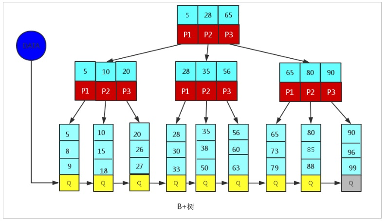

**笔记整理来源 [黑马程序员MySQL教程](https://www.bilibili.com/video/BV1UQ4y1P7Xr)**

## 索引

### 索引概述

定义：索引是帮助MySQL高效获取数据的数据结构（有序）。


<!-- more -->

左边是数据表，一共有两列七条记录，最左边的是数据记录的物理地址（注意逻辑上相邻的记录在磁盘上也并不是一定物理相邻的）。为了加快Col2的查找，可以维护一个右边所示的二叉查找树，每个节点分别包含索引键值和一个指向对应数据记录物理地址的指针，这样就可以运用二叉查找快速获取到相应数据。

一般来说索引本身也很大，不可能全部存储在内存中，因此索引往往以索引文件的形式存储在磁盘上。索引是数据库中用来提高性能的最常用的工具。


### 索引的优劣势

优势：

1. 提高数据检索的效率，降低数据库的IO成本。
2. 通过索引列对数据进行排序，降低数据排序的成本，降低CPU的消耗。

劣势：

1. 实际上索引也是一张表，该表中保存了主键与索引字段，并指向实体类的记录，所以索引列也是要占用空间的。

2. 虽然索引大大提高了查询效率，同时却也降低更新表的速度，如对表进行INSERT、UPDATE、DELETE。因为更新表时，MySQL 不仅要保存数据，还要保存一下索引文件，每次更新了索引列的字段，都会调整因为更新所带来的键值变化后的索引信息。

   

### 索引结构

索引是在MySQL的存储引擎层中实现的，而不是在服务器层实现的。所以每种存储引擎的索引都不一定完全相同，也不是所有的存储引擎都支持所有的索引类型的。

| 索引      | InnoDB引擎      | MyISAM引擎 | Memory引擎 |
| --------- | --------------- | ---------- | ---------- |
| BTREE索引 | 支持            | 支持       | 支持       |
| HASH 索引 | 不支持          | 不支持     | 支持       |
| Full-text | 5.6版本之后支持 | 支持       | 不支持     |

我们平常所说的索引，如果没有特别指明，都是指B+树（多路搜索树，并不一定是二叉的）结构组织的索引。其中聚集索引、复合索引、前缀索引、唯一索引默认都是使用 B+tree 索引，统称为 索引。


#### BTREE结构

BTree又叫多路平衡搜索树，一颗m叉的BTree特性如下：

- 树中每个节点最多包含m个孩子。
- 除根节点与叶子节点外，每个节点至少有[ceil(m/2)]个孩子。
- 若根节点不是叶子节点，则至少有两个孩子。
- 所有的叶子节点都在同一层。
- 每个非叶子节点由n个key与n+1个指针组成，其中[ceil(m/2)-1] <= n <= m-1 

以5叉BTree为例，key的数量：公式推导[ceil(m/2)-1] <= n <= m-1。所以 2 <= n <=4 。当n>4时，中间节点分裂到父节点，两边节点分裂。

插入 C N G A H E K Q M F W L T Z D P R X Y S 数据为例。

演变过程如下：

1). 插入前4个字母 C N G A 

 

2). 插入H，n>4，中间元素G字母向上分裂到新的节点

 

3). 插入E，K，Q不需要分裂

 

4). 插入M，中间元素M字母向上分裂到父节点G

 

5). 插入F，W，L，T不需要分裂

 

6). 插入Z，中间元素T向上分裂到父节点中 

 

7). 插入D，中间元素D向上分裂到父节点中。然后插入P，R，X，Y不需要分裂

 

8). 最后插入S，NPQR节点n>5，中间节点Q向上分裂，但分裂后父节点DGMT的n>5，中间节点M向上分裂

 

到此，该BTREE树就已经构建完成了， BTREE树 和 二叉树 相比， 查询数据的效率更高， 因为对于相同的数据量来说，BTREE的层级结构比二叉树小，因此搜索速度快。

#### B+TREE 结构

B+Tree为BTree的变种，B+Tree与BTree的区别为：

1). n叉B+Tree最多含有n个key，而BTree最多含有n-1个key。

2). B+Tree的叶子节点保存所有的key信息，依key大小顺序排列。

3). 所有的非叶子节点都可以看作是key的索引部分。

 

由于B+Tree只有叶子节点保存key信息，查询任何key都要从root走到叶子。所以B+Tree的查询效率更加稳定。


#### MySQL中的B+Tree

MySql索引数据结构对经典的B+Tree进行了优化。在原B+Tree的基础上，增加一个指向相邻叶子节点的链表指针，就形成了带有顺序指针的B+Tree，提高区间访问的性能。

MySQL中的 B+Tree 索引结构示意图: 

  


### 索引分类

1. 单值索引 ：即一个索引只包含单个列，一个表可以有多个单列索引

2.  唯一索引 ：索引列的值必须唯一，但允许有空值

3.  复合索引 ：即一个索引包含多个列

   

### 索引语法

#### 创建索引、删除索引、查看索引

语法：

```sql
CREATE 	[UNIQUE|FULLTEXT|SPATIAL]  INDEX index_name 
[USING  index_type]
ON tbl_name(index_col_name,...)

index_col_name : column_name[(length)][ASC | DESC]

#删除索引
DROP  INDEX  index_name  ON  tbl_name;
#查看索引,可选参数：\G
SHOW INDEX  FROM  table_name\G;
```

#### ALTER命令

```sql
1). alter  table  tb_name  add  primary  key(column_list); 

	该语句添加一个主键，这意味着索引值必须是唯一的，且不能为NULL
	
2). alter  table  tb_name  add  unique index_name(column_list);
	
	这条语句创建索引的值必须是唯一的（除了NULL外，NULL可能会出现多次）
	
3). alter  table  tb_name  add  index index_name(column_list);

	添加普通索引， 索引值可以出现多次。
	
4). alter  table  tb_name  add  fulltext  index_name(column_list);
	
	该语句指定了索引为FULLTEXT， 用于全文索引
```


### 设计原则

索引的设计可以遵循一些已有的原则，创建索引的时候请尽量考虑符合这些原则，便于提升索引的使用效率，更高效的使用索引。

- 对查询频次较高，且数据量比较大的表建立索引。
- 索引字段的选择，最佳候选列应当从where子句的条件中提取，如果where子句中的组合比较多，那么应当挑选最常用、过滤效果最好的列的组合。
- 使用唯一索引，区分度越高，使用索引的效率越高。
- 索引可以有效的提升查询数据的效率，但索引数量不是多多益善，索引越多，维护索引的代价自然也就水涨船高。对于插入、更新、删除等DML操作比较频繁的表来说，索引过多，会引入相当高的维护代价，降低DML操作的效率，增加相应操作的时间消耗。另外索引过多的话，MySQL也会犯选择困难病，虽然最终仍然会找到一个可用的索引，但无疑提高了选择的代价。
- 使用短索引，索引创建之后也是使用硬盘来存储的，因此提升索引访问的I/O效率，也可以提升总体的访问效率。假如构成索引的字段总长度比较短，那么在给定大小的存储块内可以存储更多的索引值，相应的可以有效的提升MySQL访问索引的I/O效率。
- 利用最左前缀，N个列组合而成的组合索引，那么相当于是创建了N个索引，如果查询时where子句中使用了组成该索引的前几个字段，那么这条查询SQL可以利用组合索引来提升查询效率。

```sql
创建复合索引:

	CREATE INDEX idx_name_email_status ON tb_seller(NAME,email,STATUS);

就相当于
	对name 创建索引 ;
	对name , email 创建了索引 ;
	对name , email, status 创建了索引 ;
```


## 视图

### 视图概述

​	视图（View）是一种虚拟存在的表。视图并不在数据库中实际存在，行和列数据来自定义视图的查询中使用的表，并且是在使用视图时动态生成的。通俗的讲，视图就是一条SELECT语句执行后返回的结果集。所以我们在创建视图的时候，主要的工作就落在创建这条SQL查询语句上。

视图相对于普通的表的优势主要包括以下几项。

- 简单：使用视图的用户完全不需要关心后面对应的表的结构、关联条件和筛选条件，对用户来说已经是过滤好的复合条件的结果集。
- 安全：使用视图的用户只能访问他们被允许查询的结果集，对表的权限管理并不能限制到某个行某个列，但是通过视图就可以简单的实现。
- 数据独立：一旦视图的结构确定了，可以屏蔽表结构变化对用户的影响，源表增加列对视图没有影响；源表修改列名，则可以通过修改视图来解决，不会造成对访问者的影响。

### 视图使用

创建视图：

```sql
CREATE [OR REPLACE] [ALGORITHM = {UNDEFINED | MERGE | TEMPTABLE}]

VIEW view_name [(column_list)]

AS select_statement

[WITH [CASCADED | LOCAL] CHECK OPTION]
```

修改视图：

```sql
ALTER [ALGORITHM = {UNDEFINED | MERGE | TEMPTABLE}]

VIEW view_name [(column_list)]

AS select_statement

[WITH [CASCADED | LOCAL] CHECK OPTION]

选项 : 
	WITH [CASCADED | LOCAL] CHECK OPTION 决定了是否允许更新数据使记录不再满足视图的条件。
	
	LOCAL ： 只要满足本视图的条件就可以更新。
	CASCADED ： 必须满足所有针对该视图的所有视图的条件才可以更新。 默认值.
```

删除视图：

```sql
DROP VIEW [IF EXISTS] view_name [, view_name] ...[RESTRICT | CASCADE]	
```

查看视图：

从 MySQL 5.1 版本开始，使用`SHOW TABLES`命令的时候不仅显示表的名字，同时也会显示视图的名字，而不存在单独显示视图的 SHOW VIEWS 命令，`SHOW TABLE STATUS`命令同理

如果需要查询某个视图的定义，可以使用 `SHOW CREATE VIEW`命令进行查看 ：


## 存储过程

### 存储过程和函数概述

​	存储过程和函数是  事先经过编译并存储在数据库中的一段 SQL 语句的集合，调用存储过程和函数可以简化应用开发人员的很多工作，减少数据在数据库和应用服务器之间的传输，对于提高数据处理的效率是有好处的。	

​	存储过程和函数的区别在于函数必须有返回值，而存储过程没有。

### 存储过程使用

创建：

```sql
CREATE PROCEDURE procedure_name ([proc_parameter[,...]])
BEGIN
	-- SQL语句
END ;
```

调用：

```sql
CALL procedure_name() ;
```

删除：

```sql
DROP PROCEDURE  [IF EXISTS] sp_name ;
```

查看：

```sql
-- 查询db_name数据库中的所有的存储过程
select name from mysql.proc where db='db_name';

-- 查询存储过程的状态信息
show procedure status;

-- 查询某个存储过程的定义
show create procedure test.pro_test01 \G;
```


### 语法

存储过程是可以编程的，意味着可以使用变量，表达式，控制结构 ， 来完成比较复杂的功能。

#### 变量

- DECLARE

  通过 DECLARE 可以定义一个局部变量，该变量的作用范围只能在 BEGIN…END 块中。

```sql
DECLARE var_name[,...] type [DEFAULT value]
```

- SET

  直接赋值使用 SET，可以赋常量或者赋表达式，具体语法如下：

```
  SET var_name = expr [, var_name = expr] ...
```

示例 : 

```sql
  DELIMITER $
  
  CREATE  PROCEDURE pro_test1()
  BEGIN
  	DECLARE NAME VARCHAR(20);#声明一个varchar型的变量name
  	SET NAME = 'MYSQL';
  	#也可以使用select ... into进行赋值操作
  	SELECT 'MYSQL' INTO NAME;
  	SELECT NAME ;
  END$
  
  DELIMITER ;
```

#### 条件判断

<font color='red'>IF</font> 语法结构 : 

```sql
if search_condition then statement_list

	[elseif search_condition then statement_list] ...
	
	[else statement_list]
	
end if;
```

<font color='red'>CASE</font> 语法结构 : 

```SQL
方式一 : 
CASE case_value

	WHEN when_value THEN statement_list
  
	[WHEN when_value THEN statement_list] ...
  
	[ELSE statement_list]
  
END CASE;

方式二 : 
CASE

	WHEN search_condition THEN statement_list
	
	[WHEN search_condition THEN statement_list] ...
	
	[ELSE statement_list]
	
END CASE;
```


#### 参数传递

语法格式 : 

```
create procedure procedure_name([in/out/inout] 参数名   参数类型)
...


IN :   该参数可以作为输入，也就是需要调用方传入值 , 默认
OUT:   该参数作为输出，也就是该参数可以作为返回值
INOUT: 既可以作为输入参数，也可以作为输出参数
```

示例:

```SQL 
create procedure pro_test5(in height int , out description varchar(100))
begin
  if height >= 180 then
    set description='身材高挑';
  elseif height >= 170 and height < 180 then
    set description='标准身材';
  else
    set description='一般身材';
  end if;
end$	
```

调用:

```
call pro_test5(168, @description)$

select @description$
```

<font color='red'>**小知识** </font>

@description :  这种变量要在变量名称前面加上“@”符号，叫做用户会话变量，代表整个会话过程他都是有作用的，这个类似于全局变量一样。

@@global.sort_buffer_size : 这种在变量前加上 "@@" 符号, 叫做 系统变量 


#### while循环

语法结构: 

```sql
while search_condition do

	statement_list
	
end while;
```

#### repeat结构

有条件的循环控制语句, 当满足条件的时候退出循环 。while 是满足条件才执行，repeat 是满足条件就退出循环。

语法结构 : 

```SQL
REPEAT

  statement_list

  UNTIL search_condition

END REPEAT;
```

#### loop和leave

<font color='red'>LOOP</font>

实现简单的循环，退出循环的条件需要使用其他的语句定义，通常可以使用 LEAVE 语句实现，具体语法如下：

```sql
[begin_label:] LOOP

  statement_list

END LOOP [end_label]
```

如果不在 statement_list 中增加退出循环的语句，那么 LOOP 语句可以用来实现简单的死循环。

<font color='red'>LEAVE</font>

用来从标注的流程构造中退出，通常和 BEGIN ... END 或者循环一起使用。下面是一个使用 LOOP 和 LEAVE 的简单例子 , 退出循环：

```SQL
CREATE PROCEDURE pro_test(in n int)
BEGIN
  declare total int default 0;
  
  abc: LOOP
    
    IF n <= 0 then
      leave ins;
    END IF;
    
    set total = total + n;
    set n = n - 1;
  	
  END LOOP abc;
  
  select total;
END
```

#### 游标/光标（略）


### 存储函数

语法结构:

``` 
CREATE FUNCTION function_name([param type ... ]) 
RETURNS type 
BEGIN
	...
END;
```

案例 : 

定义一个存储过程, 请求满足条件的总记录数 ;

```SQL
create function count_city(countryId int)
returns int
begin
  declare cnum int ;
  
  select count(*) into cnum from city where country_id = countryId;
  
  return cnum;
end
```

调用: 

```
select count_city(1);
select count_city(12);
```


## 触发器

#### 介绍

触发器是与表有关的数据库对象，指在 insert/update/delete 之前或之后，触发并执行触发器中定义的SQL语句集合。触发器的这种特性可以协助应用在数据库端确保数据的完整性 , 日志记录 , 数据校验等操作 。

使用别名 OLD 和 NEW 来引用触发器中发生变化的记录内容，这与其他的数据库是相似的。现在触发器还只支持行级触发，不支持语句级触发。

| 触发器类型      | NEW 和 OLD的使用                                        |
| --------------- | ------------------------------------------------------- |
| INSERT 型触发器 | NEW 表示将要或者已经新增的数据                          |
| UPDATE 型触发器 | OLD 表示修改之前的数据 , NEW 表示将要或已经修改后的数据 |
| DELETE 型触发器 | OLD 表示将要或者已经删除的数据                          |


#### 创建触发器

语法结构 : 

```sql
create trigger trigger_name 

before/after insert/update/delete

on tbl_name 

[ for each row ]  -- 行级触发器

begin

	trigger_stmt ;

end;
```


#### 使用示例

> 需求：通过触发器记录 emp 表的数据变更日志 , 包含增加, 修改 , 删除；

首先创建一张日志表 : 

```sql
create table emp_logs(
  id int(11) not null auto_increment,
  operation varchar(20) not null comment '操作类型, insert/update/delete',
  operate_time datetime not null comment '操作时间',
  operate_id int(11) not null comment '操作表的ID',
  operate_params varchar(500) comment '操作参数',
  primary key(`id`)
)engine=innodb default charset=utf8;
```

创建 insert 型触发器，完成插入数据时的日志记录 : 

```sql
DELIMITER $

create trigger emp_logs_insert_trigger
after insert 
on emp 
for each row 
begin
  insert into emp_logs (id,operation,operate_time,operate_id,operate_params) values(null,'insert',now(),new.id,concat('插入后(id:',new.id,', name:',new.name,', age:',new.age,', salary:',new.salary,')'));	
end $

DELIMITER ;
```

创建 update 型触发器，完成更新数据时的日志记录 : 

``` sql
DELIMITER $

create trigger emp_logs_update_trigger
after update 
on emp 
for each row 
begin
  insert into emp_logs (id,operation,operate_time,operate_id,operate_params) values(null,'update',now(),new.id,concat('修改前(id:',old.id,', name:',old.name,', age:',old.age,', salary:',old.salary,') , 修改后(id',new.id, 'name:',new.name,', age:',new.age,', salary:',new.salary,')'));                                                                      
end $

DELIMITER ;
```

创建delete 行的触发器 , 完成删除数据时的日志记录 : 

```sql
DELIMITER $

create trigger emp_logs_delete_trigger
after delete 
on emp 
for each row 
begin
  insert into emp_logs (id,operation,operate_time,operate_id,operate_params) values(null,'delete',now(),old.id,concat('删除前(id:',old.id,', name:',old.name,', age:',old.age,', salary:',old.salary,')'));                                                                      
end $

DELIMITER ;
```

测试：

```sql
insert into emp(id,name,age,salary) values(null, '光明左使',30,3500);
insert into emp(id,name,age,salary) values(null, '光明右使',33,3200);

update emp set age = 39 where id = 3;

delete from emp where id = 5;
```


#### 删除触发器

语法结构 : 

```sql
drop trigger [schema_name.]trigger_name
```

如果没有指定 schema_name，默认为当前数据库 。

#### 查看触发器

可以通过执行 SHOW TRIGGERS 命令查看触发器的状态、语法等信息。

语法结构 ： 

```sql
show triggers ;
```
