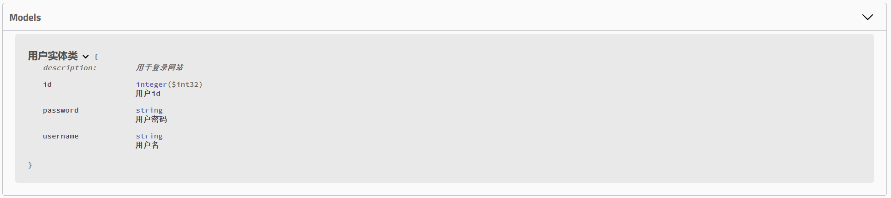
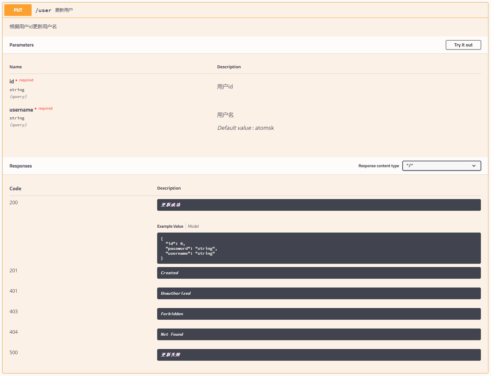

## 第一步：加入相关依赖

```xml
<dependency>
    <groupId>io.springfox</groupId>
    <artifactId>springfox-swagger2</artifactId>
    <version>2.9.2</version>
</dependency>
<dependency>
    <groupId>io.springfox</groupId>
    <artifactId>springfox-swagger-ui</artifactId>
    <version>2.9.2</version>
</dependency>
<dependency>
    <groupId>org.springframework.boot</groupId>
    <artifactId>spring-boot-starter-web</artifactId>
</dependency>
```

<!-- more -->

***

## 第二步：创建Swagger2配置

```java
@Configuration
@EnableSwagger2
public class Swagger2Config {
    @Bean
    Docket docket(){
        return new Docket(DocumentationType.SWAGGER_2)
                .select()
                .apis(RequestHandlerSelectors.basePackage("com.atomsk.swagger2.controller"))
                .paths(PathSelectors.any())
                .build().apiInfo(new ApiInfoBuilder()
                        .description("接口文档的描述信息")
                        .title("xxx项目接口文档")
                        .contact(new Contact("atomsk", "https://atomskgit.github.io/blog/",
                                "atomsk@126.com"))
                        .version("v1.0")
                        .license("Apache2.0")
                        .build());

    }
}
```

 配置完成后就可以开启项目在`http://localhost:8080/swagger-ui.html`里看到效果了。

***

## 第三步：给模块和接口加上注释

### 模块相关注释

```java
@ApiModel(value = "用户实体类",description = "用于登录网站")
public class User {
    @ApiModelProperty(value = "用户id")
    private Integer id;
    @ApiModelProperty(value = "用户名")
    private String username;
    @ApiModelProperty(value = "用户密码")
    private String password;   
}
```

效果如图:



### 接口相关注释

```java
@Api(tags = "用户管理相关接口")//@Api 注解可以用来标记当前 Controller 的功能。
@RestController
@RequestMapping("/user")
public class UserController {
    @ApiOperation(value = "更新用户", notes = "根据用户id更新用户名")
    @ApiImplicitParams({
            @ApiImplicitParam(name = "id", value = "用户id", required = true),
            @ApiImplicitParam(name = "username", value = "用户名", required = true,
                    defaultValue = "atomsk")
    })
    @ApiResponses({
            @ApiResponse(code = 200, message = "更新成功"),
            @ApiResponse(code = 500, message = "更新失败")
    })
    @PutMapping("/user")
    public User updateUsernameById(String username, Integer id) {
        User user = new User();
        user.setId(id);
        user.setUsername(username);
        return user;
    }
}
```

效果如图：



***

## 注意

如果配置了Spring Security，记得做以下配置防止Swagger2文件被拦截

```java
@Override
public void configure(WebSecurity web) throws Exception {
    web.ignoring()
            .antMatchers("/swagger-ui.html")
            .antMatchers("/v2/**")
            .antMatchers("/swagger-resources/**");
}
```

