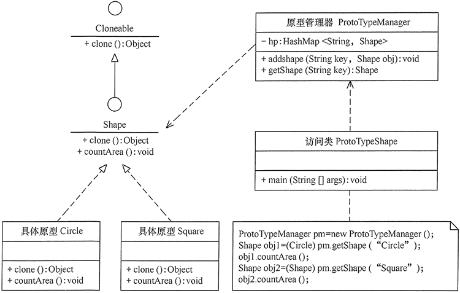
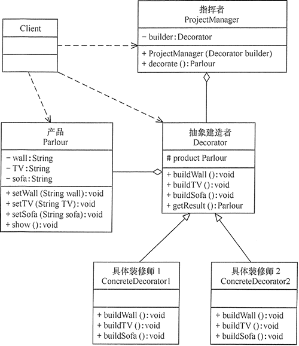

## 创建型模式

创建型模式的主要关注点是“怎样创建对象？”，它的主要特点是“将对象的创建与使用分离”。这样可以降低系统的耦合度，使用者不需要关注对象的创建细节，对象的创建由相关的工厂来完成。就像我们去商场购买商品时，不需要知道商品是怎么生产出来一样，因为它们由专门的厂商生产。

创建型模式分为以下几种。

- 单例（Singleton）模式：某个类只能生成一个实例，该类提供了一个全局访问点供外部获取该实例，其拓展是有限多例模式。
- 原型（Prototype）模式：将一个对象作为原型，通过对其进行复制而克隆出多个和原型类似的新实例。
- 工厂方法（FactoryMethod）模式：定义一个用于创建产品的接口，由子类决定生产什么产品。
- 抽象工厂（AbstractFactory）模式：提供一个创建产品族的接口，其每个子类可以生产一系列相关的产品。
- 建造者（Builder）模式：将一个复杂对象分解成多个相对简单的部分，然后根据不同需要分别创建它们，最后构建成该复杂对象。

<!-- more -->

以上 5 种创建型模式，除了[工厂方法模式](https://atomskgit.github.io/blog/2020/07/10/design-patterns-factory/)属于类创建型模式，其他的全部属于对象创建型模式


## 单例（Singleton）模式

参考[博客地址](https://blog.csdn.net/baolingye/article/details/101106783)

### 饿汉式

饿汉模式，可以想象一个很饿的人，需要立马吃东西，饿汉模式便是这样，在类加载时就创建对象，由于在类加载时就创建单例，因此不存在线程安全问题

```java
public class Hungry {
    
	// 可能会浪费空间
    private byte[] data1 = new byte[1024*1024];
    private byte[] data2 = new byte[1024*1024];
    private byte[] data3 = new byte[1024*1024];
    private byte[] data4 = new byte[1024*1024];
    
    private Hungry(){
    }
    
    private final static Hungry HUNGRY = new Hungry();
    
    public static Hungry getInstance(){
    	return HUNGRY;
    }
}
```

> 如果在该类里面存在大量开辟空间的语句，但又不马上使用他们，这时这样的单例模式会消耗大量的内存，影响性能


### 懒汉式

顾名思义，懒汉式，就是懒，即在类加载时并不会立马创建单例对象，而是只生成一个单例的引用，即可以延时加载

```java
public class LazyMan {
    
    private LazyMan() {
    }

    private static LazyMan instance;

    //提供公共的获取方法,因为不是在类加载时就创建对象，因此存在线程安全问题，使用synchronized关键字保证线程安全，效率降低
    public static synchronized LazyMan getInstance() {
        if (instance == null) {
            instance = new LazyMan();
        }
        return instance;
    }
}
```

> 懒汉式使用同步锁锁住了整个方法，效率较低


### DCL懒汉式(双重检测锁模式)

参考[博客地址](https://blog.csdn.net/qq_27489007/article/details/84966680)

双重检测锁模式的关键点：

1. 防止多线程重复创建——双重检测
2. 避免实例化对象时指令重排——volatile关键字

```java
public class LazyMan {
    2. private volatile static LazyMan lazyMan;
    
    1. public static LazyMan getInstance(){
        if (lazyMan==null){
            synchronized (LazyMan.class){
                if (lazyMan==null){
                    //不是一个原子性操作，所以要给对象加上volatile关键字
                    lazyMan = new LazyMan();
            	}
        	}
        }
        return lazyMan;
    }
}
```

> 由于JVM底层内部模型的原因，偶尔会出现问题，因此不建议使用


### 静态内部类

使用静态内部类解决了线程安全问题，并实现了延时加载

```java
public class Holder{
    private Holder(){}
    
    public static Holder getInstance(){
        return InnerClass.HOLDER;
    }
    public static calss InnerClass{
        private static finnal Holder HOLDER=new Holder();
    }
}
```


对于以上四种实现单例模式的方式，都可以使用反射进行破坏，因此可以用一个随机标识位防止反射破坏，但不能阻止反编译破解

```java
    private static boolean atomsk = false;

    private Singleton(){
        synchronized (Singleton.class){
            if (atomsk == false){
                atomsk = true;
            }else {
                throw new RuntimeException("不要试图使用反射破坏异常");
            }
        }
    }
```


### 枚举单例

使用枚举可以阻止反射，详见[狂神说单例](https://www.bilibili.com/video/av840224141)

```java
public enum EnumSingle{
    INSTANCE;
    public EnumSingle getInstance(){
        return INSTANCE;
    }
}
```


### 五种实现单例模式的方式的对比

- 饿汉式：线程安全（不排除反射），调用效率高，不能延时加载

- 懒汉式：线程安全（不排除反射）,调用效率不高，可以延时加载

- DCL懒汉式：由于JVM底层模型原因，偶尔出现问题，不建议使用

- 静态内部类式：线程安全（不排除反射），调用效率高，可以延时加载

- <font color='red'>枚举单例：线程安全，调用效率高，不能延时加载</font>

  

### 单例模式常见场景

- Windows的任务管理器、回收站等
- servlet中每个servlet都是单例
- 数据库连接池一般都是单例的
- Spring中每个Bean都是单例的


## 原型（Prototype）模式

### 原型模式的定义与特点

原型（Prototype）模式的定义如下：用一个已经创建的实例作为原型，通过复制该原型对象来创建一个和原型相同或相似的新对象。在这里，原型实例指定了要创建的对象的种类。用这种方式创建对象非常高效，根本无须知道对象创建的细节。


### 原型模式的结构

由于 [Java](http://c.biancheng.net/java/) 提供了对象的 clone() 方法，所以用 Java 实现原型模式很简单。

<!-- more -->

原型模式包含以下主要角色。

1. 抽象原型类：规定了具体原型对象必须实现的接口。
2. 具体原型类：实现抽象原型类的 clone() 方法，它是可被复制的对象。
3. 访问类：使用具体原型类中的 clone() 方法来复制新的对象。


其结构图如图 1 所示。

<center>
<br>图1 原型模式的结构图</center>


### 原型模式的扩展

原型模式可扩展为带原型管理器的原型模式，它在原型模式的基础上增加了一个原型管理器 PrototypeManager 类。该类用 HashMap 保存多个复制的原型，Client 类可以通过管理器的 get(String id) 方法从中获取复制的原型。其结构图如图 2 所示。

<center>
<br>图2 带原型管理器的原型模式的结构图</center>


【例1】用带原型管理器的原型模式来生成包含“圆”和“正方形”等图形的原型，并计算其面积。分析：本实例中由于存在不同的图形类，例如，“圆”和“正方形”，它们计算面积的方法不一样，所以需要用一个原型管理器来管理它们，图 3 所示是其结构图。

<center>
<br>图3 图形生成器的结构图</center>


## 建造者（Builder）模式

### 模式的定义与特点

建造者（Builder）模式的定义：指将一个复杂对象的构造与它的表示分离，使同样的构建过程可以创建不同的表示，这样的[设计模式](https://atomskgit.github.io/blog/2020/07/09/design-patterns-summery/)被称为建造者模式。它是将一个复杂的对象分解为多个简单的对象，然后一步一步构建而成。它将变与不变相分离，即产品的组成部分是不变的，但每一部分是可以灵活选择的。

该模式的主要优点如下：

1. 各个具体的建造者相互独立，有利于系统的扩展。
2. 客户端不必知道产品内部组成的细节，便于控制细节风险。


其缺点如下：

1. 产品的组成部分必须相同，这限制了其使用范围。
2. 如果产品的内部变化复杂，该模式会增加很多的建造者类。


建造者（Builder）模式和工厂模式的关注点不同：建造者模式注重零部件的组装过程，而[工厂方法模式](https://atomskgit.github.io/blog/2020/07/10/design-patterns-factory/)更注重零部件的创建过程，但两者可以结合使用。


### 模式的结构

建造者（Builder）模式的主要角色如下。

1. 产品角色（Product）：它是包含多个组成部件的复杂对象，由具体建造者来创建其各个滅部件。
2. 抽象建造者（Builder）：它是一个包含创建产品各个子部件的抽象方法的接口，通常还包含一个返回复杂产品的方法 getResult()。
3. 具体建造者(Concrete Builder）：实现 Builder 接口，完成复杂产品的各个部件的具体创建方法。
4. 指挥者（Director）：它调用建造者对象中的部件构造与装配方法完成复杂对象的创建，在指挥者中不涉及具体产品的信息。


### 模式的应用实例

【例1】用建造者（Builder）模式描述客厅装修。

分析：客厅装修是一个复杂的过程，它包含墙体的装修、电视机的选择、沙发的购买与布局等。客户把装修要求告诉项目经理，项目经理指挥装修工人一步步装修，最后完成整个客厅的装修与布局，所以本实例用建造者模式实现比较适合。

这里客厅是产品，包括墙、电视和沙发等组成部分。具体装修工人是具体建造者，他们负责装修与墙、电视和沙发的布局。项目经理是指挥者，他负责指挥装修工人进行装修。

其类图如图 4 所示。

<center>
    <br>图4 客厅装修的结构图</center>


### 模式的应用场景

建造者（Builder）模式创建的是复杂对象，其产品的各个部分经常面临着剧烈的变化，但将它们组合在一起的算法却相对稳定，所以它通常在以下场合使用。

- 创建的对象较复杂，由多个部件构成，各部件面临着复杂的变化，但构件间的建造顺序是稳定的。
- 创建复杂对象的算法独立于该对象的组成部分以及它们的装配方式，即产品的构建过程和最终的表示是独立的。


### 模式的扩展

建造者（Builder）模式在应用过程中可以根据需要改变，如果创建的产品种类只有一种，只需要一个具体建造者，这时可以省略掉抽象建造者，甚至可以省略掉指挥者角色。