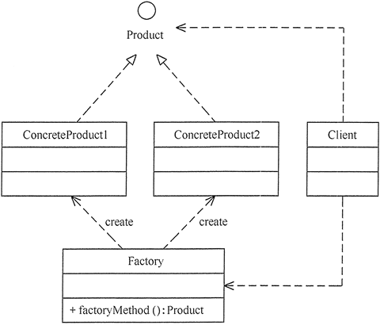
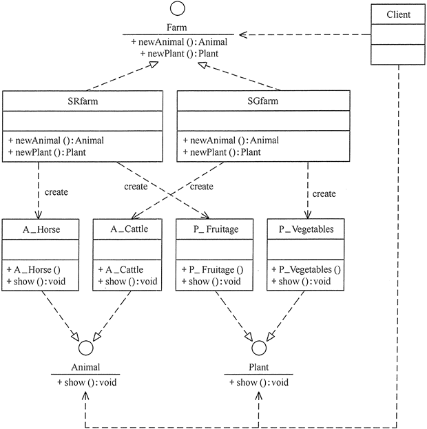

## 工厂方法（FactoryMethod）模式

### 模式的定义与特点

工厂方法（FactoryMethod）模式的定义：定义一个创建产品对象的工厂接口，将产品对象的实际创建工作推迟到具体子工厂类当中。这满足创建型模式中所要求的“创建与使用相分离”的特点。

我们把被创建的对象称为“产品”，把创建产品的对象称为“工厂”。如果要创建的产品不多，只要一个工厂类就可以完成，这种模式叫“简单工厂模式”，它不属于 GoF 的 23 种经典[设计模式](http://c.biancheng.net/design_pattern/)，它的缺点是增加新产品时会违背“开闭原则”。

工厂方法模式的主要优点有：

- 用户只需要知道具体工厂的名称就可得到所要的产品，无须知道产品的具体创建过程；
- 在系统增加新的产品时只需要添加具体产品类和对应的具体工厂类，无须对原工厂进行任何修改，满足开闭原则；

其缺点是：每增加一个产品就要增加一个具体产品类和一个对应的具体工厂类，这增加了系统的复杂度。

<!-- more -->

### 模式的结构

工厂方法模式的主要角色如下。

1. 抽象工厂（Abstract Factory）：提供了创建产品的接口，调用者通过它访问具体工厂的工厂方法 newProduct() 来创建产品。
2. 具体工厂（ConcreteFactory）：主要是实现抽象工厂中的抽象方法，完成具体产品的创建。
3. 抽象产品（Product）：定义了产品的规范，描述了产品的主要特性和功能。
4. 具体产品（ConcreteProduct）：实现了抽象产品角色所定义的接口，由具体工厂来创建，它同具体工厂之间一一对应。

### 模式的应用实例

【例1】用工厂方法模式设计畜牧场。

分析：有很多种类的畜牧场，如养马场用于养马，养牛场用于养牛，所以该实例用工厂方法模式比较适合。

对养马场和养牛场等具体工厂类，只要定义一个生成动物的方法 newAnimal() 即可，并定义一个 show() 方法来显示它们。

其结构图如图 1 所示。

 图1 畜牧场结构图

### 模式的应用场景

工厂方法模式通常适用于以下场景。

- 客户只知道创建产品的工厂名，而不知道具体的产品名。如 TCL 电视工厂、海信电视工厂等。
- 创建对象的任务由多个具体子工厂中的某一个完成，而抽象工厂只提供创建产品的接口。
- 客户不关心创建产品的细节，只关心产品的品牌。

### 模式的扩展

当需要生成的产品不多且不会增加，一个具体工厂类就可以完成任务时，可删除抽象工厂类。这时工厂方法模式将退化到简单工厂模式，其结构图如图 2所示。

 图2 简单工厂模式的结构图

---

## 抽象工厂（AbstractFactory）模式

前面介绍的[工厂方法模式](http://c.biancheng.net/view/1348.html)中考虑的是一类产品的生产，如畜牧场只养动物、电视机厂只生产电视机、计算机软件学院只培养计算机软件专业的学生等。

同种类称为同等级，也就是说：[工厂方法模式](http://c.biancheng.net/view/1348.html)只考虑生产同等级的产品，但是在现实生活中许多工厂是综合型的工厂，能生产多等级（种类） 的产品，如农场里既养动物又种植物，电器厂既生产电视机又生产洗衣机或空调，大学既有软件专业又有生物专业等。

本节要介绍的抽象工厂模式将考虑多等级产品的生产，将同一个具体工厂所生产的位于不同等级的一组产品称为一个产品族，图 13所示的是海尔工厂和 TCL 工厂所生产的电视机与空调对应的关系图。

 图3 电器工厂的产品等级与产品族

### 模式的定义与特点

抽象工厂（AbstractFactory）模式的定义：是一种为访问类提供一个创建一组相关或相互依赖对象的接口，且访问类无须指定所要产品的具体类就能得到同族的不同等级的产品的模式结构。

抽象工厂模式是工厂方法模式的升级版本，工厂方法模式只生产一个等级的产品，而抽象工厂模式可生产多个等级的产品。

使用抽象工厂模式一般要满足以下条件。

- 系统中有多个产品族，每个具体工厂创建同一族但属于不同等级结构的产品。
- 系统一次只可能消费其中某一族产品，即同族的产品一起使用。

抽象工厂模式除了具有工厂方法模式的优点外，其他主要优点如下。

- 可以在类的内部对产品族中相关联的多等级产品共同管理，而不必专门引入多个新的类来进行管理。
- 当增加一个新的产品族时不需要修改原代码，满足开闭原则。

其缺点是：当产品族中需要增加一个新的产品时，所有的工厂类都需要进行修改。

### 模式的结构

抽象工厂模式同工厂方法模式一样，也是由抽象工厂、具体工厂、抽象产品和具体产品等 4 个要素构成，但抽象工厂中方法个数不同，抽象产品的个数也不同。现在我们来分析其基本结构和实现方法。

抽象工厂模式的主要角色如下。

1. 抽象工厂（Abstract Factory）：提供了创建产品的接口，它包含多个创建产品的方法 newProduct()，可以创建多个不同等级的产品。
2. 具体工厂（Concrete Factory）：主要是实现抽象工厂中的多个抽象方法，完成具体产品的创建。
3. 抽象产品（Product）：定义了产品的规范，描述了产品的主要特性和功能，抽象工厂模式有多个抽象产品。
4. 具体产品（ConcreteProduct）：实现了抽象产品角色所定义的接口，由具体工厂来创建，它 同具体工厂之间是多对一的关系。

### 模式的应用实例

【例1】用抽象工厂模式设计农场类。

分析：农场中除了像畜牧场一样可以养动物，还可以培养植物，如养马、养牛、种菜、种水果等，所以本实例比前面介绍的畜牧场类复杂，必须用抽象工厂模式来实现。

本例用抽象工厂模式来设计两个农场，一个是韶关农场用于养牛和种菜，一个是上饶农场用于养马和种水果，可以在以上两个农场中定义一个生成动物的方法 newAnimal() 和一个培养植物的方法 newPlant()。

其结构图如图 4 所示。

 图4 农场类的结构图

### 模式的应用场景

抽象工厂模式最早的应用是用于创建属于不同操作系统的视窗构件。如 java 的 AWT 中的 Button 和 Text 等构件在 Windows 和 UNIX 中的本地实现是不同的。

抽象工厂模式通常适用于以下场景：

1. 当需要创建的对象是一系列相互关联或相互依赖的产品族时，如电器工厂中的电视机、洗衣机、空调等。
2. 系统中有多个产品族，但每次只使用其中的某一族产品。如有人只喜欢穿某一个品牌的衣服和鞋。
3. 系统中提供了产品的类库，且所有产品的接口相同，客户端不依赖产品实例的创建细节和内部结构。

### 模式的扩展

抽象工厂模式的扩展有一定的“开闭原则”倾斜性：

1. 当增加一个新的产品族时只需增加一个新的具体工厂，不需要修改原代码，满足开闭原则。
2. 当产品族中需要增加一个新种类的产品时，则所有的工厂类都需要进行修改，不满足开闭原则。

另一方面，当系统中只存在一个等级结构的产品时，抽象工厂模式将退化到工厂方法模式。

## 工厂方法和抽象工厂的区别

来源：[**抽象工厂、工厂方法和简单工厂的不同点及使用心得**](https://www.jianshu.com/p/4523dcb131c8)

### 抽象工厂模式

​		假设有m家工厂，n种部件，如果按照抽象工厂模式去设计的话，最终将会有1个抽象工厂接口（客户端用来初始化并决定具体用哪家工厂去生产产品），n个抽象部件接口（定义每个部件的规范标准，这些标准在各个工厂下都是一样的），m个具体工厂类（每个工厂有n个方法，用来初始化n个具体部件生产类），m*n个具体部件类（这些类是真正生产产品的类）。

【例2】1个抽象工厂接口，2个部件（手机和路由器)不同厂商对应产品

抽象工厂对于变化的封装：

1. 如果要切换工厂，只需要在最开始初始化工厂类的时候换另一家工厂就好了，而整个结构都无需改动。
2. 如果增加部件，抽象工厂接口以及其子工厂都需要添加能生产此部件的方法，同时还需要添加一个此部件的抽象接口以及每种工厂生产这种部件的具体方法，好处是已有的部件类不需要改动。
3. 如果增加工厂，首先需要增加此工厂并实现抽象工厂类，同时需要在每个抽象部件那里加一个此工厂生产对应部件的具体类，好处是已有工厂类和部件类都不需要改动。

综上所述，抽象工厂模式基本上完美的遵循了开放封闭原则，即使第二种情况需要修改已有的工厂类，但由于工厂类的职责是去初始化并返回一个真正的部件生产类，因此已有的核心类部件类依然没有因为扩展而做过任何修改。

### 工厂方法模式

​		工厂方法可以说是**抽象工厂的一个特例**，当工厂里只有一种产品的时候，抽象工厂的结构就简化成工厂方法的结构了。此时会有一个抽象工厂接口，一个抽象产品接口，假设还是有m家工厂，那么会有m个具体工厂类，同时有m个具体产品类，工厂类和产品类是一一对应的关系，每个工厂类负责去初始化其对应的产品类。

​		工厂方法也是符合开放封闭原则的，如果再加一个新的工厂，只需要增加一个工厂类和此工厂生产产品的具体类就OK了，其他工厂类和产品类都无需改动。

### 简单工厂模式

​		简单工厂模式并没有AbstractFactory接口，它是根据参数或者配置文件等事先定义好的变量，然后利用**分支判断**或者**反射技术**来动态的初始化具体产品类并返回。它的产品类接口和数量与其他两种工厂模式一样，不同的地方在于它没有那么多的工厂类，可以只用一个静态工厂类来生成想要的产品。
  由于增加工厂或者产品都需要修改静态工厂类，因此它不符合开放封闭原则。好处是大大减少了工厂类，若使用了反射技术，也会减少很多判断分支代码量。

### 使用场景总结

​		如果产品单一，并且客户端在创建产品实例时需要用灵活的参数来指定具体使用哪种工厂，那么可以优先使用简单工厂；若客户端相对稳定的指定一种工厂，同时在多个地方用此工厂创建产品类，则优先考虑用工厂方法模式。如果产品有多种，则考虑使用抽象工厂模式。需要注意的是抽象工厂模式里的工厂类既可以用工厂方法来实现，此时是标准的抽象工厂模式；也可用简单工厂来实现，这种情况一般是用一个静态工厂类和多个静态方法来代替那一大堆的工厂类，工厂种类的指定可以用常量或配置文件，并且在一定的环境下相对稳定。

