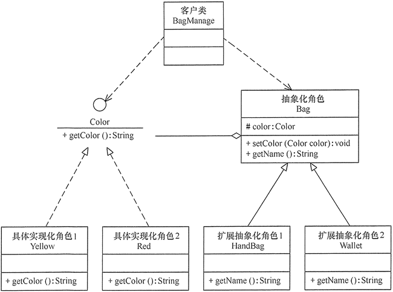

## 结构型模式

结构型模式描述如何将类或对象按某种布局组成更大的结构。它分为类结构型模式和对象结构型模式，前者采用继承机制来组织接口和类，后者釆用组合或聚合来组合对象。

由于组合关系或聚合关系比继承关系耦合度低，满足“合成复用原则”，所以对象结构型模式比类结构型模式具有更大的灵活性。

结构型模式分为以下 7 种：

<!-- more -->

1. 代理（Proxy）模式：为某对象提供一种代理以控制对该对象的访问。即客户端通过代理间接地访问该对象，从而限制、增强或修改该对象的一些特性。
2. 适配器（Adapter）模式：将一个类的接口转换成客户希望的另外一个接口，使得原本由于接口不兼容而不能一起工作的那些类能一起工作。
3. 桥接（Bridge）模式：将抽象与实现分离，使它们可以独立变化。它是用组合关系代替继承关系来实现的，从而降低了抽象和实现这两个可变维度的耦合度。
4. 装饰（Decorator）模式：动态地给对象增加一些职责，即增加其额外的功能。
5. 外观（Facade）模式：为多个复杂的子系统提供一个一致的接口，使这些子系统更加容易被访问。
6. 享元（Flyweight）模式：运用共享技术来有效地支持大量细粒度对象的复用。
7. 组合（Composite）模式：将对象组合成树状层次结构，使用户对单个对象和组合对象具有一致的访问性。


以上 7 种结构型模式，除了**适配器模式**分为类结构型模式和对象结构型模式两种，其他的全部属于对象结构型模式，下面我们会分别、详细地介绍它们的特点、结构与应用。


## 适配器（Adapter）模式

### 模式的定义与特点

适配器模式（Adapter）的定义如下：将一个类的接口转换成客户希望的另外一个接口，使得原本由于接口不兼容而不能一起工作的那些类能一起工作。适配器模式分为类结构型模式和对象结构型模式两种，前者类之间的耦合度比后者高，且要求程序员了解现有组件库中的相关组件的内部结构，所以应用相对较少些。

该模式的主要优点如下。

- 客户端通过适配器可以透明地调用目标接口。
- 复用了现存的类，程序员不需要修改原有代码而重用现有的适配者类。
- 将目标类和适配者类解耦，解决了目标类和适配者类接口不一致的问题。


其缺点是：对类适配器来说，更换适配器的实现过程比较复杂。


### 模式的结构与实现

类适配器模式可采用多重继承方式实现，如 [C++](http://c.biancheng.net/cplus/) 可定义一个适配器类来同时继承当前系统的业务接口和现有组件库中已经存在的组件接口；[Java](http://c.biancheng.net/java/) 不支持多继承，但可以定义一个适配器类来实现当前系统的业务接口，同时又继承现有组件库中已经存在的组件。

对象适配器模式可釆用将现有组件库中已经实现的组件引入适配器类中，该类同时实现当前系统的业务接口。现在来介绍它们的基本结构。

#### 1. 模式的结构

适配器模式（Adapter）包含以下主要角色。

1. 目标（Target）接口：当前系统业务所期待的接口，它可以是抽象类或接口。
2. 适配者（Adaptee）类：它是被访问和适配的现存组件库中的组件接口。
3. 适配器（Adapter）类：它是一个转换器，通过继承或引用适配者的对象，把适配者接口转换成目标接口，让客户按目标接口的格式访问适配者。

类适配器模式的结构图如图 1 所示。

<center>
<br>图1 类适配器模式的结构图</center>


对象适配器模式的结构图如图 2 所示。

<center>
<br>图2 对象适配器模式的结构图</center>


#### 2. 模式的实现

(1) 类适配器模式的代码如下。

```java
package adapter;
//目标接口
interface Target
{
    public void request();
}
//适配者接口
class Adaptee
{
    public void specificRequest()
    {       
        System.out.println("适配者中的业务代码被调用！");
    }
}
//类适配器类
class ClassAdapter extends Adaptee implements Target
{
    public void request()
    {
        specificRequest();
    }
}
//客户端代码
public class ClassAdapterTest
{
    public static void main(String[] args)
    {
        System.out.println("类适配器模式测试：");
        Target target = new ClassAdapter();
        target.request();
    }
}
```


程序的运行结果如下：

```
类适配器模式测试：
适配者中的业务代码被调用！
```


(2)对象适配器模式的代码如下。

```java
package adapter;
//对象适配器类
class ObjectAdapter implements Target
{
    private Adaptee adaptee;
    public ObjectAdapter(Adaptee adaptee)
    {
        this.adaptee=adaptee;
    }
    public void request()
    {
        adaptee.specificRequest();
    }
}
//客户端代码
public class ObjectAdapterTest
{
    public static void main(String[] args)
    {
        System.out.println("对象适配器模式测试：");
        Adaptee adaptee = new Adaptee();
        Target target = new ObjectAdapter(adaptee);
        target.request();
    }
}
```


说明：对象适配器模式中的“目标接口”和“适配者类”的代码同类适配器模式一样，只要修改适配器类和客户端的代码即可。

程序的运行结果如下：

```
对象适配器模式测试：
适配者中的业务代码被调用！
```


### 模式的应用场景

适配器模式（Adapter）通常适用于以下场景。

- 以前开发的系统存在满足新系统功能需求的类，但其接口同新系统的接口不一致。
- 使用第三方提供的组件，但组件接口定义和自己要求的接口定义不同。


### 模式的扩展

适配器模式（Adapter）可扩展为双向适配器模式，双向适配器类既可以把适配者接口转换成目标接口，也可以把目标接口转换成适配者接口，其结构图如图 3 所示。

<center>
<br>图3 双向适配器模式的结构图</center>


## 桥接（Bridge）模式

### 桥接模式的定义与特点

桥接（Bridge）模式的定义如下：将抽象与实现分离，使它们可以独立变化。它是用组合关系代替继承关系来实现，从而降低了抽象和实现这两个可变维度的耦合度。

桥接（Bridge）模式的优点是：

- 由于抽象与实现分离，所以扩展能力强；
- 其实现细节对客户透明。


缺点是：由于聚合关系建立在抽象层，要求开发者针对抽象化进行设计与编程，这增加了系统的理解与设计难度。


### 桥接模式的结构

可以将抽象化部分与实现化部分分开，取消二者的继承关系，改用组合关系。

桥接（Bridge）模式包含以下主要角色。

1. 抽象化（Abstraction）角色：定义抽象类，并包含一个对实现化对象的引用。
2. 扩展抽象化（Refined  Abstraction）角色：是抽象化角色的子类，实现父类中的业务方法，并通过组合关系调用实现化角色中的业务方法。
3. 实现化（Implementor）角色：定义实现化角色的接口，供扩展抽象化角色调用。
4. 具体实现化（Concrete Implementor）角色：给出实现化角色接口的具体实现。


### 桥接模式的应用实例

【例1】用桥接（Bridge）模式模拟女士皮包的选购。

分析：女士皮包有很多种，可以按用途分、按皮质分、按品牌分、按颜色分、按大小分等，存在多个维度的变化，所以采用桥接模式来实现女士皮包的选购比较合适。

本实例按用途分可选钱包（Wallet）和挎包（HandBag），按颜色分可选黄色（Yellow）和红色（Red）。可以按两个维度定义为颜色类和包类。

颜色类（Color）是一个维度，定义为实现化角色，它有两个具体实现化角色：黄色和红色，通过 getColor() 方法可以选择颜色；包类（Bag）是另一个维度，定义为抽象化角色，它有两个扩展抽象化角色：挎包和钱包，它包含了颜色类对象，通过 getName() 方法可以选择相关颜色的挎包和钱包。

该例子结构图如图 3 所示。

<center>
<br>图3 女士皮包选购的结构图</center>

程序代码如下：

```java
//实现化角色：颜色
interface Color
{
    String getColor();
}
//具体实现化角色：黄色
class Yellow implements Color
{
    public String getColor()
    {
        return "yellow";
    }
}
//具体实现化角色：红色
class Red implements Color
{
    public String getColor()
    {
        return "red";
    }
}
//抽象化角色：包
abstract class Bag
{
    protected Color color;
    public void setColor(Color color)
    {
        this.color=color;
    }   
    public abstract String getName();
}
//扩展抽象化角色：挎包
class HandBag extends Bag
{
    public String getName()
    {
        return color.getColor()+"HandBag";
    }   
}
//扩展抽象化角色：钱包
class Wallet extends Bag
{
    public String getName()
    {
        return color.getColor()+"Wallet";
    }   
}
```


### 桥接模式的应用场景

桥接模式通常适用于以下场景。

1. 当一个类存在两个独立变化的维度，且这两个维度都需要进行扩展时。
2. 当一个系统不希望使用继承或因为多层次继承导致系统类的个数急剧增加时。
3. 当一个系统需要在构件的抽象化角色和具体化角色之间增加更多的灵活性时。


### 桥接模式模式的扩展

在软件开发中，有时桥接（Bridge）模式可与适配器模式联合使用。当桥接（Bridge）模式的实现化角色的接口与现有类的接口不一致时，可以在二者中间定义一个适配器将二者连接起来，其具体结构图如图 4 所示。

<center>
<br>图4 桥接模式与适配器模式联用的结构图</center>