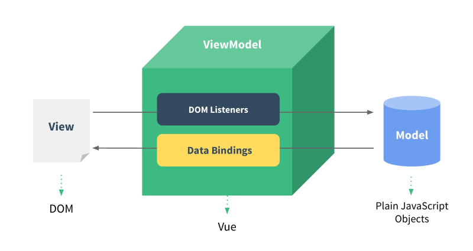

## **Vue.js是什么?**

是一位华裔工程师（尤雨溪）开发的前端js库

特点：

1. **遵循MVVM模式**



<!-- more -->

2. 编码简洁, 体积小, 运行效率高, 移动/PC端开发

3. 它本身只关注UI, 可以轻松引入vue插件和其它第三库开发项目

vue常用的组件库：

- vue-cli: vue脚手架

- vue-resource(axios): ajax请求

* vue-router: 路由
* vuex: 状态管理
* vue-lazyload: 图片懒加载
* vue-scroller: 页面滑动相关
* mint-ui: 基于vue的组件库(移动端)
* element-ui: 基于vue的组件库(PC端)

---

## **基本使用**

```html
<div id="test">
  <input type="text" v-model="msg"><br>
  <p>hello {{msg}}</p><br>
  <a v-bind:href="url">访问指定站点</a><br>
  <button v-on:click="test("atomsk")">v-on测试</button>
</div>
<script type="text/javascript" src="../js/vue.js"></script>
<script type="text/javascript">
  const vm = new Vue({
    el: '#test',
    data: {
      msg: 'vue',
      url: 'https://atomskgit.github.io/blog'
    },
    methods: {
      test (name) {
        alert(name + '你好啊!!!')
      }
    }
  })
</script>
```

1. vm里的属性：
   1. el：指定dom标签容器的选择器，vue就会管理对应标签及其字标签
   2. data：初始化数据
2. 双大括号表达式{{expr}}
3. v-xxx指令：
   1. 双向数据绑定：v-model="msg"
   2. 强制数据绑定：v-bind:href="url"，可简写成 **:href="url"**
   3. 绑定事件监听：v-on:click="test"，可简写成 **@click="test"**

## **计算属性和监视属性**

### **计算属性**

1. 在computed属性对象中定义计算属性的方法，在页面中用{{方法名}}
2. 显示结果利用getter/setter方法实现对属性数据的显示和监视
3. 有缓存，多次读取只执行一次getter

### 监视属性

1. 通过通过 vm 对象的$watch()或 watch 属性对象配置来监视指定的属性
2. 当属性变化时, 回调函数自动调用, 在函数内部进行计算

computed和watch对比：

```html
  姓: <input type="text" placeholder="First Name" v-model="firstName"><br>
  名: <input type="text" placeholder="Last Name" v-model="lastName"><br>

  姓名1: <input type="text" placeholder="Full Name1" v-model="fullName1"><br>
  姓名2: <input type="text" placeholder="Full Name2" v-model="fullName2"><br>
<script>
computed: {
	fullName1: {
        // 当获取当前属性值时自动调用, 将返回值作为属性值
        get () {
          return this.firstName + '-' + this.lastName
        },
        // 当属性值发生了改变时自动调用
        set (value) {//value即当前监视属性的值
          const names = value.split('-')
          this.firstName = names[0]
          this.lastName = names[1]
        }
      }
//watch的第一种形式
watch: {
      // 配置监视firstName
      firstName: function (value) {
        this.fullName2 = value + '-' + this.lastName
      }
    }
//watch的第二种形式
vm.$watch('lastName', function (value) {
    this.fullName2 = this.firstName + '-' + value
  })
</script>
```

---

## **绑定class和style**

```html
<!--class的三种形式 -->
<p :class="myclass">表达式是字符串</p>
<p :class="{classA: hasClassA, classB: hasClassB}">表达式是对象</p>
<p :class="['classA', 'classC']"> 表达式是数组</p>
<!--style -->
<p :style="{color:activeColor,  fontSize: fontSize}"></p>
<button @click="update">更新</button>
```

改变对应的变量即可：

```html
<script>
    methods: {
      update () {
        this.myClass = 'classB'
        this.hasClassA = true
        this.hasClassB = !hasClassB
        this.activeColor = 'red'
        this.fontSize = '30px'
      }
    }
</script>
```

---

## **生命周期**

详见：https://www.jianshu.com/p/4d3e554269c1


---

## **一些干货**

使用 v-for遍历对象，第一个参数是值，第二个参数是键

```html
<ul>
    <li v-for="(p, index) in persons" :key="index">
      {{index}}--{{p.name}}--{{p.age}}
    </li>
</ul>
```

事件修饰符：

* @click.prevent=”xxx"：阻止事件的默认行为，即 event.preventDefault()
* @click.stop ="xxx"：停止事件冒泡，即 event.stopPropagation()

按键修饰符：@keydown.按键码/常用按键名="xxx"。使用：给密码输入框或者验证码输入框加上sumbit方法

过滤器：对要显示的数据进行特定格式化后再显示

```html
定义:
Vue.filter(filterName, function(value[,arg1,arg2,...]){
  // 进行一定的数据处理
  return newValue
})
使用：
<div>{{myData | filterName}}</div>
<div>{{myData | filterName(arg)}}</div>
```

其他指令：

- ref : 为某个元素注册一个唯一标识, vue对象通过$refs属性访问这个元素对象
- v-cloak : 主要用于隐藏未被vue解析到的元素, 在style里加上: [v-cloak] { display: none }